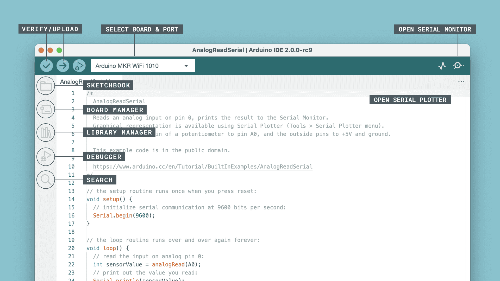

# Puntos Ciegos
## Prototipo medidor de distancias
El prototipo medidor de distancias se implementó utilizando la placa de desarrollo NodeMCU junto con sensores de tipo Sharp y ultrasónicos.

### Software
Para la implementación del código fuente se utilizó el software Arduino IDE


# Pasos para la implementación
## Prueba de placa de desarrollo NodeMCU
Se recomienda probar el estado de los pines de la placa de desarrollo, ya que para la implementación del prototipo se utilizarán la mayoría de los pines disponibles. Para ello se recomienda compilar el código fuente que proporciona el IDE y verificar su correcto funcionamiento.

## Prueba de sensores
Una vez verificado el estado de la placa de desarrollo, se recomienda realizar pruebas de funcionamiento de los sensores de tipo sharp y ultrasónico que se utilizarán para implementar el prototipo, para lo cual se recomienda revisar la rama ```feat/lectura-ultrasonico``` con el siguiente comando:
```bash
git checkout feat/lectura-ultrasonico
```

## Prueba de cliente mcu
El siguiente paso es probar si la conexión inalámbrica generada por la placa de desarrollo NodeMCU funciona de manera correcta para lo cuál se recomienda revisar la rama ```feat/cliente-mcu``` con el siguiente comando:
```bash
git checkout feat/cliente-mcu
```
Una vez compilado el código fuente, verificar con un teléfono móvil si efecivamente se ha creado una red wifi con el nombre especificado en el código. De no ser así, verificar la alimentación de la placa de desarrollo o la integridad del mismo.

## Prueba de envío de datos por sockets
Finalmente, si las pruebas se realizaron correctamente, se puede realizar la prueba de envío de lecturas a la aplicación móvil. El código fuente se encuentra en la rama ```main``` con el siguiente comando:
```bash
git checkout main
```
Al conectarse la aplicación móvil a la red wifi generada por la placa NodeMCU, se debe poder apreciar la recepción de datos, los cuales serán interpretados por el mismo y se visualizará en la interfaz de usuario.

